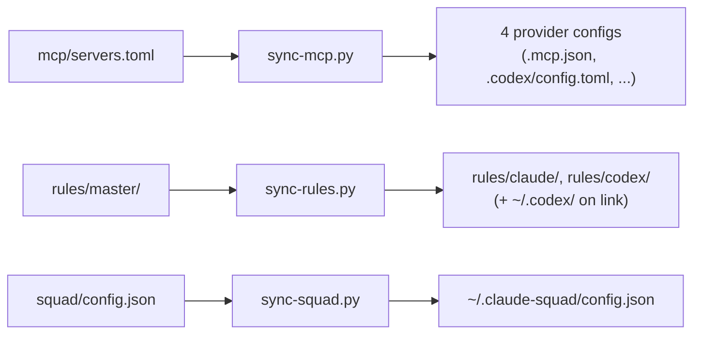
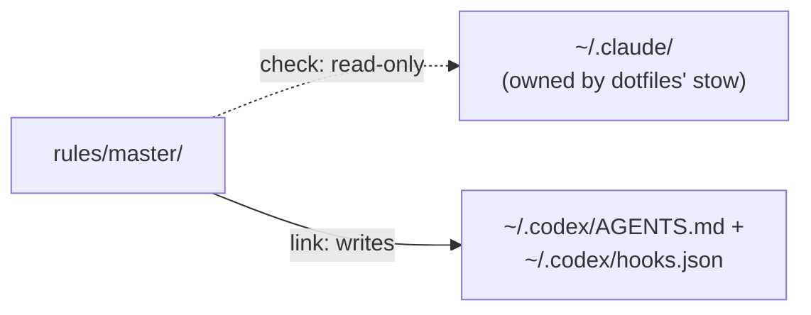

# Architecture

Why this repo is shaped the way it is. For what each recipe does, see
[recipes.md](./recipes.md). For the conventions behind those recipes, see
[conventions.md](./conventions.md).

## One source, many targets

Every AI CLI here (Claude Code, Antigravity, opencode, Codex) speaks its own config
format. Three concerns — MCP servers, global rules/hooks, and claude-squad profiles — are
each authored **once**, then rendered per target by a small script. Same shape, three
times:

**Why one source per concern.** Four hand-maintained copies of "which MCP servers exist"
drift the moment one gets an update the others miss. A canonical file plus a renderer
makes drift impossible instead of merely unlikely — the renderer is the only thing that
writes the target files, so they're never edited by hand
(`README.md`'s Layout section says this outright: *"Never hand-edit `.mcp.json`... they're
generated and gitignored"*).

**Why a script, not a shared library.** `scripts/sync-mcp.py`, `scripts/sync-rules.py`, and
`scripts/sync-squad.py` don't share code. Each is a self-contained `uv run --script` file —
consistent with "no premature abstraction": three concerns, three small scripts, each
readable on its own rather than through a shared abstraction built for a fourth concern
that doesn't exist yet.

## Rules and hooks: Claude vs. Codex

The rules/hooks pipeline treats its two consumers differently on purpose:

- **Claude already has an owner.** `~/dotfiles/claude`'s own `stow` mechanism puts
  `CLAUDE.md` and `rules/*.md` at `~/.claude`. This repo vendors a byte-for-byte copy at
  `rules/master/` and only ever **checks** it against the live files
  (`just check-rules`) — `link`/`unlink claude` are refused outright, on purpose, so this
  repo can never fight dotfiles' stow for the same file.
- **Codex has no owner yet.** Nothing else manages `~/.codex/AGENTS.md`, so this repo
  **writes** it — the same `rules/master/` content, concatenated into one file, because
  Codex reads a single global instructions file rather than a directory of them.

Same source, two different verbs, because the two targets start from a different state.

## The provider module contract

`claude/`, `antigravity/`, `opencode/`, `codex/`, `ollama/`, and `squad/` each expose the
same four recipes (`start`, `check`, `link`, `unlink`) from their own `justfile`, surfaced
at the root via `mod <name>`. `squad/` is the one exception in spirit, not structure: it
doesn't add a model provider, it orchestrates the other five. See
[recipes.md](./recipes.md) for what each recipe actually runs, and
[conventions.md](./conventions.md) for why the contract looks like this.
