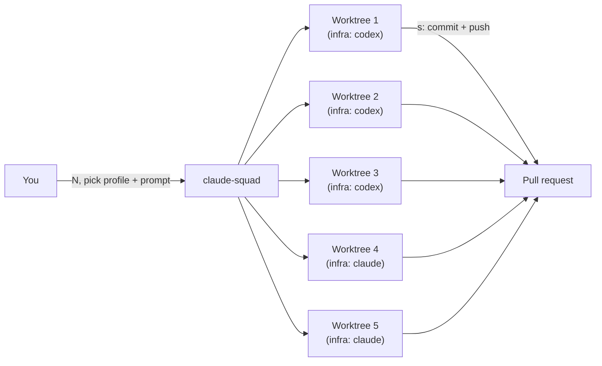

# Walkthrough: giving `infra` the rest of the toolkit

A concrete example, using `~/dev/armarquez/infra` — a real, already-in-use repo — as the
subject. Nothing here is infra-specific advice; swap in any other repo's path.

## What infra already has, and what this adds

`infra` isn't starting from zero. Its most recent commit is *"Add secret key architecture
doc and agent sandbox policy"* — it already has its own `mise.toml`, `direnv`, `CLAUDE.md`,
a `.claude/` sandbox policy, and its own `secrets.env` (own vault refs, resolved by its own
`scripts/agent-session.sh` wrapper — a separate scaffold, unrelated to ai-workspace's
`secrets.env`). It already works with Claude Code, on its own.

| | infra already has | ai-workspace adds |
|---|---|---|
| Claude Code | ✓ own toolchain, own sandbox policy | — |
| `secrets.env` (op:// refs, no real secrets) | ✓ own vault, own `agent-session.sh` wrapper — currently empty of refs | the `OPENROUTER_API_KEY` ref opencode needs, appended by hand — see Step 2. Codex and Antigravity need nothing here — they authenticate with their own login |
| Codex, opencode, Antigravity | ✗ | ✓ |
| Parallel agent sessions | ✗ | ✓ (claude-squad) |
| `AGENTS.md` (generic, non-Claude-specific instructions) | ✗ | ✓ (`just onboard agents-md`) |
| Agent-CLI tool pins in `mise.toml` | ✗ | ✓ (`just onboard mise-tools`) |
| `basic-memory` in `.mcp.json` | ✗ | ✓ (`just onboard mcp`) |

So this walkthrough's job is narrow: give `infra` the providers it doesn't have, the
generic-instructions file other providers read natively, the one op:// ref opencode needs
in infra's own `secrets.env`, and the ability to run several providers at once, each in
its own worktree.

## Prerequisite

ai-workspace itself is bootstrapped once, from *this* repo:

```sh
mise trust && mise install
just bootstrap
```

If `just doctor` is clean (or the only warnings are "not yet linked," which is expected —
linking is opt-in), the prerequisite is met. This is the one step that happens in
ai-workspace's own directory; everything below happens from `infra`'s.

## Step 1 — the mechanical setup: AGENTS.md, mise.toml, .mcp.json

`onboard/` (see [recipes.md](./recipes.md#onboard--onboarding-a-target-repo)) automates the
three pieces that don't need a human judgment call. Every command below is a dry-run —
prints its plan, writes nothing — unless `--apply` is passed:

```sh
just onboard check ~/dev/armarquez/infra          # read-only status first
just onboard all ~/dev/armarquez/infra            # dry-run plan
just onboard all ~/dev/armarquez/infra --apply    # write it
```

This converts `infra`'s `CLAUDE.md` into `AGENTS.md` (with `CLAUDE.md` reduced to
`@AGENTS.md`), adds the agent-CLI tool pins from ai-workspace's own `mise.toml` that
`infra` is missing, and merges `basic-memory` into `infra`'s `.mcp.json`. It never runs
git in `infra` — review the diff and commit it there yourself, the normal way. See
[conventions.md](./conventions.md#onboarding-a-target-repo) for the full safety model,
including how a version conflict (an agent-CLI tool `infra` already pins at a different
version) is reported, never silently resolved.

## Step 2 — one extra agent on infra

Codex and Antigravity need nothing here — like `claude` (which infra already runs, via
its own `agent-session.sh`), both authenticate with their own subscription/account login,
not an `op://` secret, so they just run directly:

```sh
cd ~/dev/armarquez/infra
codex
agy
```

**opencode is the exception** — it authenticates via OpenRouter, a real API key with no
subscription alternative, so it needs the `OPENROUTER_API_KEY` op:// ref ai-workspace's
own `secrets.env` defines. Which path to take depends on whether the target repo already
has a `secrets.env` of its own — two different situations, both covered below.

**If the target has no `secrets.env` at all**, there's nothing local to add the ref to, so
point `op run` at ai-workspace's absolute path instead:

```sh
cd ~/dev/armarquez/some-other-repo
op run --env-file=~/dev/armarquez/ai-workspace/secrets.env -- opencode
```

**`infra` already has its own `secrets.env`** (added by a separate scaffold, for infra's
own secrets — see the table above), just not this ref yet. Append it there instead of
reaching for an absolute path:

```sh
# infra/secrets.env
OPENROUTER_API_KEY=op://Personal/OpenRouter API/credential
```

Then run with a plain relative path, same as ai-workspace's own `opencode/justfile` does:

```sh
cd ~/dev/armarquez/infra
op run --env-file=secrets.env -- opencode
```

**Caveat:** infra's own `scripts/agent-session.sh` wrapper only launches `claude`, with a
`--settings .claude/sandbox-policy.json` flag that's Claude-specific. Codex, opencode, and
Antigravity above all bypass that wrapper — and its sandbox policy — entirely. Extending
the wrapper to cover them is a separate, infra-specific change; this walkthrough doesn't do
it for you.

## Step 3 — parallel agents on infra via claude-squad

`onboard squad` generates infra-specific claude-squad profiles — named `infra: claude`,
`infra: codex`, etc. so they can't collide with another onboarded repo's or with
ai-workspace's own unqualified `claude`/`codex`/etc. `claude`, `codex`, and `antigravity`
need no secrets, so those profiles run the same everywhere, unchanged. `opencode` is the
exception: since `infra` already has its own `secrets.env` (per the table above), `onboard
squad` appends the `OPENROUTER_API_KEY` ref its profile needs. If `infra` had no
`secrets.env` of its own, the generated opencode profile would use an absolute path to
ai-workspace's instead — same two cases as Step 2, handled automatically:

```sh
just onboard squad ~/dev/armarquez/infra            # dry-run plan
just onboard squad ~/dev/armarquez/infra --apply    # writes infra/secrets.env (if needed)
                                                     # and infra/.ai-workspace/squad-profiles.json
just squad link-target ~/dev/armarquez/infra        # merges those profiles into
                                                     # ~/.claude-squad/config.json
```

`infra/.ai-workspace/` is machine-specific (an absolute-path case would point at *this*
machine's ai-workspace checkout) — add it to `infra`'s `.gitignore` (the `--apply` step
prints a reminder). `just squad unlink-target ~/dev/armarquez/infra` reverses the merge,
removing only the `infra: ...` profiles.

**Now launch it.** `just squad start` won't work here — it's scoped to ai-workspace's own
root (see the gotcha in [recipes.md](./recipes.md)). Run the binary directly from `infra`'s
directory instead, where the `infra: ...` profiles generated above are now selectable:

```sh
cd ~/dev/armarquez/infra
claude-squad
```

## Step 4 — a worked example: 3 codex sessions + 2 claude sessions



**`n` vs `N` — only one of them lets you pick a profile.** Plain `n` creates a session
immediately using one fixed program for claude-squad's entire run — whatever
`default_program` resolves to against your profiles (see the caveat below), or the
`--program` flag if you launched with one. It never shows a profile picker and never
changes mid-run, so every plain-`n` session uses the same tool. To choose the tool
per session, use `N` (shift+N) instead:

1. `N` — type a short title (becomes the branch name, 32 characters max), press `↵`.
2. This opens a prompt overlay: a profile picker at the top (`←`/`→` to change — shown
   whenever more than one profile exists), a branch search box, and a text box for the
   session's initial prompt.
3. Arrow to the profile you want, type the task for this session, press `↵`. The session
   starts immediately in its own worktree and branch, with that prompt already sent.

**To get 3 `infra: codex` sessions and 2 `infra: claude` sessions**, repeat that `N` loop
five times — a distinct title and task each time, arrowing to `infra: codex` for the first
three and `infra: claude` for the last two. Each press is independent; there's no
batch/bulk command, and no cap on mixing tools — only on total session count
(`GlobalInstanceLimit`, 10 per claude-squad run today).

- `tab` toggles between a session's live output and a diff of its worktree — review either
  without leaving the TUI.
- `↑/j`, `↓/k` move between sessions in the list.
- `↵`/`o` attaches to a session to reprompt it directly; `ctrl-q` detaches back to the list.
- `s` commits and pushes a session's branch, once you're happy with it. Open the PR the
  normal way from there.

## Caveats

- **`default_program` must exactly match a profile's `name`, or it silently does nothing.**
  Verified against `config/config.go` in the pinned fork (`GetProfiles()`/`GetProgram()`):
  both only special-case `default_program` by comparing it to each profile's `name` field.
  Set it to a literal path or command (`/usr/local/bin/claude`, the pre-profiles default)
  once profiles exist, and neither function ever matches — the profile picker's
  pre-selected entry falls back to whatever is first in the `profiles` array (not
  necessarily what you'd call "default"), and a plain `n` session (see Step 4) resolves to
  `default_program`'s literal value run as a command, not a profile lookup. Set it to one
  of your profile names instead (e.g. `"infra: claude"`) to get the reorder-to-first
  behavior the config format implies.
- **`PATH` may not resolve what you expect.** A clean shell test (a login shell with no
  inherited state) found `claude`/`codex` resolving to unrelated `/usr/local/bin` installs
  and `gh` resolving to a machine-specific fork — none of them the mise-pinned versions.
  `just squad check` (run from ai-workspace) reports the `gh` case explicitly; the same
  risk applies to any CLI you invoke directly rather than through a `just <provider>
  start` recipe. If a command isn't behaving like the pinned version, run `which <cli>`
  first.
- **`op run`'s session cache is per-shell.** Only the `opencode` profile touches it, but
  running several `opencode` sessions in parallel can still mean several independent
  1Password prompts, unless a session token is already exported in the shell claude-squad
  itself launches from (see [conventions.md](./conventions.md#the-secrets-model)).
- **Two different sandbox postures are now in play.** `infra`'s own `.claude/` policy
  covers Claude Code sessions on it. Codex sessions on the same repo fall back to
  ai-workspace's native-only Codex sandbox (`codex/config-base.toml`) — no
  credential-masking egress proxy, so a secret in a Codex session's environment reaches
  whatever host `network_access` allows, as its real value. See
  [conventions.md](./conventions.md#sandbox-posture) for the full comparison. Nothing
  here extends `infra`'s own Claude sandbox policy to Codex — that would need its own,
  separate design.
