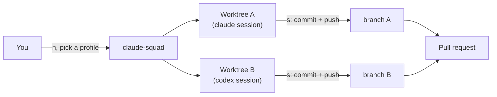

# Walkthrough: giving `infra` the rest of the toolkit

A concrete example, using `~/dev/armarquez/infra` — a real, already-in-use repo — as the
subject. Nothing here is infra-specific advice; swap in any other repo's path.

## What infra already has, and what this adds

`infra` isn't starting from zero. Its most recent commit is *"Add secret key architecture
doc and agent sandbox policy"* — it already has its own `mise.toml`, `direnv`, `CLAUDE.md`,
and a `.claude/` sandbox policy. It already works with Claude Code, on its own.

| | infra already has | ai-workspace adds |
|---|---|---|
| Claude Code | ✓ own toolchain, own sandbox policy | — |
| Codex, opencode, Antigravity | ✗ | ✓ |
| Parallel agent sessions | ✗ | ✓ (claude-squad) |
| `AGENTS.md` (generic, non-Claude-specific instructions) | ✗ | ✓ (`just onboard agents-md`) |
| Agent-CLI tool pins in `mise.toml` | ✗ | ✓ (`just onboard mise-tools`) |
| `basic-memory` in `.mcp.json` | ✗ | ✓ (`just onboard mcp`) |

So this walkthrough's job is narrow: give `infra` the providers it doesn't have, the
generic-instructions file other providers read natively, and the ability to run several
providers at once, each in its own worktree.

## Prerequisite

ai-workspace itself is bootstrapped once, from *this* repo:

```sh
mise trust && mise install
just bootstrap
```

If `just doctor` is clean (or the only warnings are "not yet linked," which is expected —
linking is opt-in), the prerequisite is met. This is the one step that happens in
ai-workspace's own directory; everything below happens from `infra`'s.

## Step 1 — the mechanical setup: AGENTS.md, mise.toml, .mcp.json

`onboard/` (see [recipes.md](./recipes.md#onboard--onboarding-a-target-repo)) automates the
three pieces that don't need a human judgment call. Every command below is a dry-run —
prints its plan, writes nothing — unless `--apply` is passed:

```sh
just onboard check ~/dev/armarquez/infra          # read-only status first
just onboard all ~/dev/armarquez/infra            # dry-run plan
just onboard all ~/dev/armarquez/infra --apply    # write it
```

This converts `infra`'s `CLAUDE.md` into `AGENTS.md` (with `CLAUDE.md` reduced to
`@AGENTS.md`), adds the agent-CLI tool pins from ai-workspace's own `mise.toml` that
`infra` is missing, and merges `basic-memory` into `infra`'s `.mcp.json`. It never runs
git in `infra` — review the diff and commit it there yourself, the normal way. See
[conventions.md](./conventions.md#onboarding-a-target-repo) for the full safety model,
including how a version conflict (an agent-CLI tool `infra` already pins at a different
version) is reported, never silently resolved.

## Step 2 — one extra agent on infra

`infra` has no `secrets.env` of its own, so the path has to be absolute:

```sh
cd ~/dev/armarquez/infra
op run --env-file=~/dev/armarquez/ai-workspace/secrets.env -- codex
```

Same idea for opencode or Antigravity — swap `codex` for `opencode`/`agy` and add
`--env-file`'s absolute path, exactly as each provider's own `start` recipe does it (see
[recipes.md](./recipes.md)), just without the `cd` that recipe would do to ai-workspace's
own root.

## Step 3 — parallel agents on infra via claude-squad

`just squad start` won't work here — it's scoped to ai-workspace's own root (see the
gotcha in [recipes.md](./recipes.md)). Run the binary directly from `infra`'s directory
instead:

```sh
cd ~/dev/armarquez/infra
claude-squad
```

**One adjustment first.** `squad/config.json`'s checked-in profiles point at a *relative*
`secrets.env`, which resolves correctly inside an ai-workspace worktree (every worktree
gets its own copy, since it's a tracked file) but not inside an `infra` worktree — `infra`
has no `secrets.env` at all. Open `~/.claude-squad/config.json` and give `infra`'s
profiles an absolute path instead:

```json
{
  "profiles": [
    { "name": "claude", "program": "op run --env-file=/Users/you/dev/armarquez/ai-workspace/secrets.env -- claude" },
    { "name": "codex",  "program": "codex" }
  ]
}
```

This is a per-target-repo edit, made once, by hand — not something `just squad link`
should guess at, since it has no way to know which repo you'll point claude-squad at next.

## Step 4 — a worked example: two agents, two worktrees



1. `n` — new session, pick the `claude` profile, give it a task.
2. `n` again — new session, pick `codex`, give it a different task. claude-squad now has
   two sessions, each in its own worktree, each on its own branch.
3. `tab` toggles between the session's live output and a diff of its worktree — review
   either without leaving the TUI.
4. `↵`/`o` attaches to a session to reprompt it directly; `ctrl-q` detaches back to the
   list.
5. `s` commits and pushes a session's branch, once you're happy with it. Open the PR the
   normal way from there.

## Caveats

- **`PATH` may not resolve what you expect.** A clean shell test (a login shell with no
  inherited state) found `claude`/`codex` resolving to unrelated `/usr/local/bin` installs
  and `gh` resolving to a machine-specific fork — none of them the mise-pinned versions.
  `just squad check` (run from ai-workspace) reports the `gh` case explicitly; the same
  risk applies to any CLI you invoke directly rather than through a `just <provider>
  start` recipe. If a command isn't behaving like the pinned version, run `which <cli>`
  first.
- **`op run`'s session cache is per-shell.** Running several profile sessions in parallel
  can mean several independent 1Password prompts unless a session token is already
  exported in the shell claude-squad itself launches from (see
  [conventions.md](./conventions.md#the-secrets-model)).
- **Two different sandbox postures are now in play.** `infra`'s own `.claude/` policy
  covers Claude Code sessions on it. Codex sessions on the same repo fall back to
  ai-workspace's native-only Codex sandbox (`codex/config-base.toml`) — no
  credential-masking egress proxy, so a secret in a Codex session's environment reaches
  whatever host `network_access` allows, as its real value. See
  [conventions.md](./conventions.md#sandbox-posture) for the full comparison. Nothing
  here extends `infra`'s own Claude sandbox policy to Codex — that would need its own,
  separate design.
