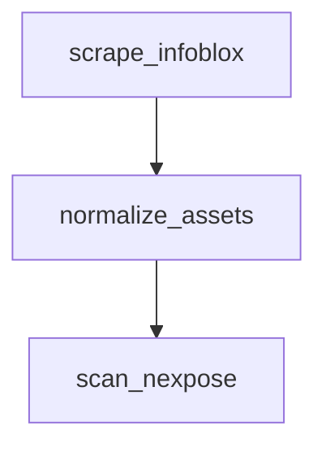

# Always use MermaidJS for diagrams

Never use ASCII art diagrams. All diagrams must be written in MermaidJS.

**Correct:**


**Wrong:**
```
scrape_infoblox --> normalize_assets --> scan_nexpose
```

## Diagram types

- `flowchart TD` (top-down) or `flowchart LR` (left-right) — data flows and process diagrams
- `sequenceDiagram` — API interactions and request/response flows
- `erDiagram` — data models and schema relationships
- `gantt` — timelines and project milestones

## Conventions

- Use `<br />` for line breaks inside node labels, NOT `\n`

## Layout

- **A subgraph's `direction` is ignored when any of its nodes connect to something outside the subgraph.** It fails silently and the nodes stack in the parent's flow direction instead. Do not reach for it to mix orientations.
- **Control layout with edges, not hints.** To render parallel nodes as a horizontal row in a `flowchart TD`, give each one its own edge to the shared next step — `T1 --> X`, `T2 --> X`, `T3 --> X`. Same-rank nodes are placed across the cross-axis, so they land side by side.
- **Never edge from a subgraph id** (`SUB --> X`) when the members need laying out. It leaves them with no edges of their own, and unconnected nodes stack vertically.
- **Group granular nodes rather than listing them all.** Six labelled boxes overflow the page; three with examples inline — `"Internal finding<br />(incident, pentest, bug bounty)"` — carry the same information and stay narrow.
- **Verify the render before calling a layout done.** These behaviours are not reliably predictable from the spec, so check the output rather than reasoning about rank direction.
